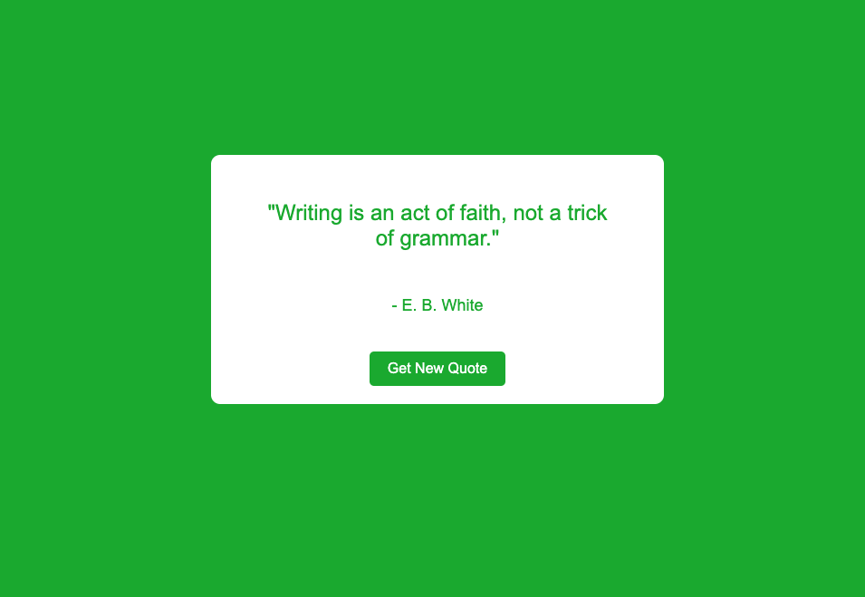

# Random Quote Machine

A simple Random Quote Machine built with React.js, which fetches and displays random quotes from an NinjasAPI. The application is designed to provide users with a new quote each time they click a button.

## 🚀 Live Demo

You can try out the Random Quote Machine live [here](https://tymoteuszmilek.github.io/random-quote-machine/).

## 📸 Screenshot



## 🛠️ Features

- Fetches random quotes from an API.
- Displays the quote and its author.
- Click the "New Quote" button to load another random quote.
- Responsive design, works well on both desktop and mobile.

## 🧑‍💻 Technologies Used

- **React.js**: For building the user interface.
- **JavaScript (ES6)**: For logic and API calls.
- **CSS**: For styling the application.
- **Ninjas API**: For fetching random quotes.

## 📦 Installation

To run this project locally, follow these steps:

1. **Clone the repository:**
   ```bash
   git clone https://github.com/tymoteuszmilek/random-quote-machine.git
   cd random-quote-machine
   
2. **Install dependencies:
   ```bash
   npm install
3. **Run the application:
    ```bash
   npm run dev
